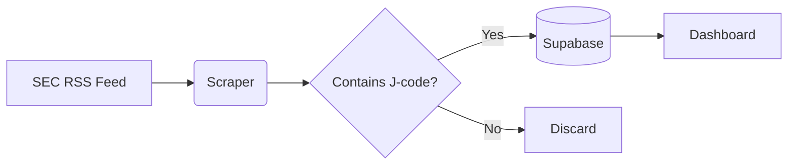

# SEC Form 4 J-Code Tracker


A real-time monitoring system that identifies suspicious "J-code" transactions in SEC Form 4 filings by corporate insiders.

## 📌 Key Features

- **Automated scraping** of SEC Form 4 filings every 15 minutes
- **J-code detection** in both derivative and non-derivative transactions
- **Duplicate-free database** using SEC accession numbers
- **Timezone-correct** timestamps (converted to ET)
- **One-click access** to original SEC filings

## 🛠️ Technology Stack

| Component       | Technology               | Purpose                          |
|-----------------|--------------------------|----------------------------------|
| Backend         | Python 3.10+             | Scraping and data processing     |
| Database        | Supabase PostgreSQL      | Persistent storage               |
| Dashboard       | Streamlit                | Interactive web interface        |
| Hosting         | GitHub Actions           | Automated scraping scheduler     |
| SEC Integration | EDGAR RSS/XML API        | Official data source             |

## 🚀 Quick Start

### Prerequisites
- Python 3.10+
- Supabase account
- GitHub account
- Streamlit Cloud account (free tier)

### 1. Local Setup
```bash
git clone https://github.com/yourusername/sec-jcode-tracker.git
cd sec-jcode-tracker

# Install dependencies
pip install -r requirements.txt

# Set up environment
echo "SUPABASE_URL=your_project_url" > .env
echo "SUPABASE_KEY=your_anon_key" >> .env
```
### 2. Database Configuration
```sql
CREATE TABLE j_code_filings (
    filing_id VARCHAR(20) PRIMARY KEY,
    ticker VARCHAR(10),
    company_name VARCHAR(255),
    filing_date TIMESTAMPTZ,
    transaction_date DATE,
    filing_url VARCHAR(255)
);

CREATE INDEX idx_jcode_filings ON j_code_filings (filing_date DESC);
```
### 3. Deployment
# Scraper (GitHub Actions)
- Create .github/workflows/scraper.yml
```yaml
name: SEC Scraper
on:
  schedule:
    - cron: '*/15 6-21 * * 1-5'  # Every 15min, 6AM-9PM EST Mon-Fri
  workflow_dispatch:
jobs:
  run:
    runs-on: ubuntu-latest
    steps:
      - uses: actions/checkout@v4
      - uses: actions/setup-python@v4
      - run: pip install -r requirements.txt
      - run: python sec_scraper.py
        env:
          SUPABASE_URL: ${{ secrets.SUPABASE_URL }}
          SUPABASE_KEY: ${{ secrets.SUPABASE_KEY }}
```
# Dashboard (Streamlit Cloud)
- Connect your GitHub repo
- Set secrets:
```toml
# .streamlit/secrets.toml
SUPABASE_URL = "your-supabase-url"
SUPABASE_KEY = "your-anon-key"
```
# 🔧 How It Works

Data Pipeline

Key Components
1. Scraper (sec_scraper.py):
- Pulls Form 4 filings from SEC RSS feed
- Identifies J-codes in XML transactions
- Upserts data to Supabase
2. Dashboard (app.py):
- Displays filings in sortable table
- Shows filing vs transaction dates
- Provides direct SEC document links
3. Duplicate Prevention:
```python
# Uses SEC accession number as primary key
supabase.table('j_code_filings').upsert({
    'filing_id': '0001013762-25-004348',
    # ...other fields
}).execute()
```
## 📊 Example Output

| Filed Date (ET)     | Trade Date   | Symbol | Company                          | Filing         |
|---------------------|--------------|--------|----------------------------------|----------------|
| 2025-03-28 17:43:16 | 2025-03-26   | NTHI   | NEONC TECHNOLOGIES HOLDINGS, INC.| [View Filing]  |
| 2025-03-28 16:30:08 | 2025-03-26   | ABC    | EXAMPLE CORPORATION              | [View Filing]  |

## 💾 Database Schema

| Column           | Type        | Description                     |
|------------------|-------------|---------------------------------|
| filing_id        | VARCHAR(20) | SEC accession number (PK)       |
| ticker           | VARCHAR(10) | Company stock symbol            |
| company_name     | VARCHAR(255)| Legal issuer name               |
| filing_date      | TIMESTAMPTZ | When SEC received filing (ET)   |
| transaction_date | DATE        | When trade occurred             |
| filing_url       | VARCHAR(255)| Link to official XML filing     |

🚨 Troubleshooting
Common Issues:
1. Missing filings:
- Verify SEC operating hours (6AM-10PM ET)
- Check GitHub Actions logs
2. Database connection fails:
- Confirm Supabase RLS (Row Level Security) is off
- Validate secrets in both GitHub and Streamlit
3. XML parsing errors:
- Check last_parse_error.txt for problematic filings
- Manually verify the SEC filing URL

📜 License
MIT License - See LICENSE for details.

Note: This project is not affiliated with the SEC. Use compliance data responsibly.

This README includes:

1. **Project Metadata** - Badges and overview
2. **Technical Specifications** - Stack table and architecture diagram
3. **Setup Instructions** - Local and cloud deployment
4. **Core Logic** - Key algorithms explained
5. **Operational Details** - Schedule, schema, troubleshooting
6. **Legal** - License disclaimer
